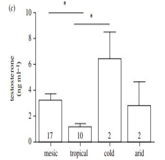

```{r, include = FALSE}
knitr::opts_chunk$set(
  collapse = TRUE,
  comment = "#>"
)
```

```{r setup, eval = T}
library(compbio4all)
```


## Introduction

The following is a set of annotated code that demonstrates how to make a plot with error bars when you already have the mean values and locations of the error bars for discreate categories of data.   The steps are:

* Enter the data into "vectors"" using c()
* Make a simple "dataframe"" using data.frame()
* Plot the data using the qplot() function from the ggplot2 package
* Add a notation about what the error bars mean 

## Key vocab/functions

* c()
* vector
* data.frame()
* qplot()
* geom_errorbar()


## Load libraries

The qplot() function is in the ggplot2 package.  cowplot has nice deafaults for plot.
```{r, echo=TRUE, message=FALSE, warning=FALSE}
library(ggplot2)
#library(cowplot)
```


## An example barplot

* The original barplot is below. 
* I estimate the height of the bar representing the mean
* Then I estimated the height of the bar plus the error bar
* I get the width of the error below using subtraction.



## The citation for the paper
Hau et al. 2010.  Corticosterone, testosterone and life-history strategies of birds.  Proceedings of the Royal Society B.  277:3203-3212


## Re-making the graph

* I am going to build up a "data frame" by hand to build the graph.  
* 1st we will add the data to individual vectors
* 2nd, we will turn those vectors into a dataframe
* 3rd, we'll make the plot


### Adding the data to R

* First, I want to put in the categories along the x-axis (horizontal axis).  
* these are different ecological conditions
* I will put then into a *"vector"* object I'm calling "category" using the c() command
* Each ecological category/condition is surrounded by quotes " " b/c the are text

```{r}

category <- c("mesic"
              ,"tropical"
              ,"cold"
              ,"arid")
```


The height of the wide bar is a mean.  I will put them into a vector called "mean.bar.top" using the c() command.  Note that these are numbers, not text, and so *ARE NOT* in quotes.
```{r}

mean.bar.top <- c(3.5, 1, 6.5, 2.75)

```


Now we'll make a vector for the tops of the error bars
```{r}

error.bar.top <- c(4, 1.25, 8.5, 5)

```

We can calcualt the length of the error bar using the vectors.  This is called "vector subtraction".  The result is the standard error (SE)
```{r}

error.bar.length <- error.bar.top - mean.bar.top

```


The original plot did not have a lower error bar, which is bad form.  We'll calcualte where it should be.

```{r}

error.bar.bottom <- mean.bar.top - error.bar.length

```


### Make dataframe from vectors

* We put the vectors into the data.frame command and save them to an object called "df"
* Note the period between data and frame (eg data.frame, not dataframe)
* Don't forget the commas after each vector!

```{r}

df <- data.frame(category,
                 mean.bar.top,
                 error.bar.top,
                 error.bar.bottom,
                 error.bar.length)

```

THe finished product looks like this
```{r}
df
```


### Making the plot


#### Basic plot
We can make a very basic plot of just the means very easily using ggplot2's qplot() function.

```{r}
qplot(y = mean.bar.top,
      x = category,
      data = df)
```


#### Add error bars

* We add error bars by putting in a "+" then using the "geom" geom_errorbar()
* Within geom_errorbar() goes the arguement aes()
* In aes() are two things: ymin, and ymax; these are the locations of the top and the bottom of the erro bars
```{r}

qplot(y = mean.bar.top,
      x = category,
      data = df) +
  geom_errorbar(aes(ymin = error.bar.bottom,
                    ymax = error.bar.top))

```


#### Make the error bars nice

Get rid of the huge cross bars using width = 0

```{r}
qplot(y = mean.bar.top,
      x = category,
      data = df) +
  geom_errorbar(aes(ymin = error.bar.bottom,
                    ymax = error.bar.top),
                width = 0)
```


#### Make the points bigger

```{r}

qplot(y = mean.bar.top,
      x = category,
      data = df) + 
  geom_errorbar(aes(ymin = error.bar.bottom,
                    ymax = error.bar.top),
                width = 0)  +
  geom_point(size = 6)

```


#### Make line widths thicker

```{r}
qplot(y = mean.bar.top,
      x = category,
      data = df) + 
  geom_errorbar(aes(ymin = error.bar.bottom,
                    ymax = error.bar.top),
                width = 0,
                size = 2)  +
  geom_point(size = 6.5)
```


#### Change Colors of everything

```{r}

qplot(y = mean.bar.top,
      x = category,
      color= category,
      data = df) + 
  geom_errorbar(aes(ymin = error.bar.bottom,
                    ymax = error.bar.top),
                width = 0,
                size = 2)  +
  geom_point(size = 5)

```


#### Protip: change color of just the points

```{r}
qplot(y = mean.bar.top,
      x = category,
      #color= category,
      data = df) + 
  geom_errorbar(aes(ymin = error.bar.bottom,
                    ymax = error.bar.top),
                width = 0,
                size = 2)  +
  geom_point(size = 5,
             aes(color = category))
```


#### Change shapes

```{r}
qplot(y = mean.bar.top,
      x = category,
      color= category,
      shape = category,
      data = df) + 
  geom_errorbar(aes(ymin = error.bar.bottom,
                    ymax = error.bar.top),
                width = 0,
                size = 2)  +
  geom_point(size = 5)

```


#### Add an annotation within the graph 

```{r, fig.width = 5, fig.height = 4}

qplot(y = mean.bar.top,
      x = category,
      color= category,
      shape = category,
      data = df) + 
  geom_errorbar(aes(ymin = error.bar.bottom,
                    ymax = error.bar.top),
                width = 0,
                size = 2)  +
  geom_point(size = 5) +
  annotate("text", x = 1, y = 8, 
           label = "Error bars = +/- 1 SE")


```


